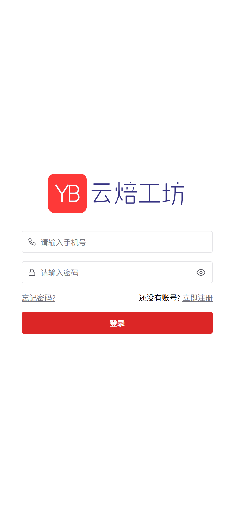
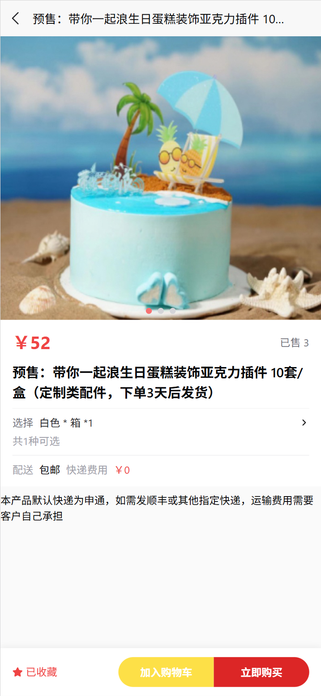
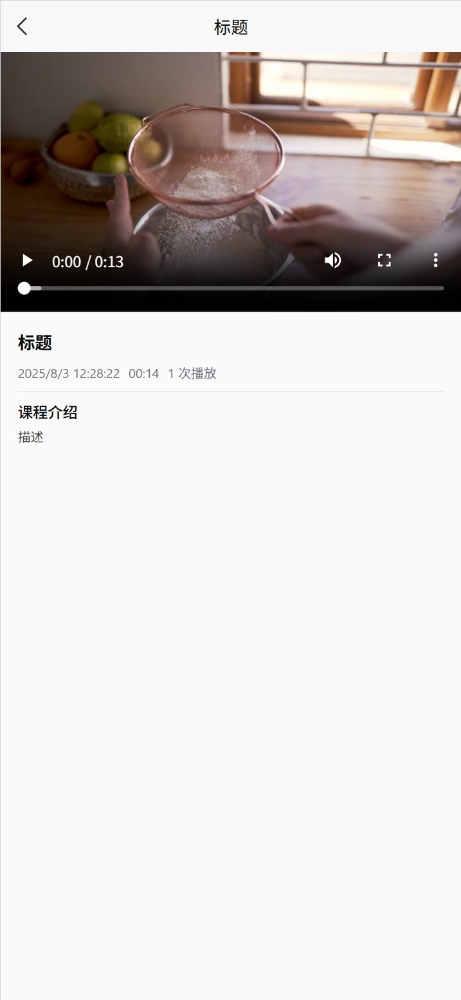

# NextMall - 现代化电商平台

<div align="center">
  <p>基于 Next.js 构建的全栈电商解决方案，集成了现代 Web 技术栈</p>
   <p>快速开发 代码易懂 方便二开 源码全开源</p>

  [](LICENSE)
  [](https://nextjs.org/)
  [](https://www.typescriptlang.org/)
  [](https://prisma.io/)
</div>

## 🚀 项目简介

NextMall 是一个功能完整的现代化电商平台，专为追求高性能和用户体验的开发者设计。项目采用 Next.js 15 + TypeScript + Prisma + React+ Chakra 的全栈技术架构，提供了完整的电商业务流程，包括商品管理、订单处理、用户系统、支付集成等核心功能。

## ✨ 核心特性

### 🛍️ 商城功能
- **商品管理**: 完整的商品发布、编辑、分类管理系统
- **多规格支持**: 支持商品多规格、库存管理
- **购物车**: 智能购物车，支持规格选择和数量调整
- **订单系统**: 完整的订单流程，从下单到发货的全流程管理
- **收货地址**: 多地址管理，支持默认地址设置

### 👥 用户系统
- **多角色权限**: 超级管理员、供应商、普通用户等多角色体系
- **认证授权**: 基于 NextAuth.js 的安全认证系统
- **用户资料**: 完整的用户信息管理和头像上传
- **收藏足迹**: 商品收藏和浏览历史功能

### 📚 内容管理
- **课程系统**: 支持视频课程发布和播放
- **合集管理**: 课程合集和分类组织
- **Banner管理**: 首页轮播图和广告位管理

### 📱 移动端适配
- **响应式设计**: 完美适配桌面端和移动端
- **PWA支持**: 渐进式 Web 应用体验
- **H5界面**: 专门优化的移动端商城界面

### 🔧 管理后台
- **超级管理员**: 拥有系统最高权限，可管理所有用户、商品、订单、供应商及平台设置，查看和分析全站销售数据、用户行为，分配和调整各类权限，进行系统维护与审计。
- **供应商**: 可管理自身商品及库存，查看本店铺的订单和销售数据，分析商品表现，及时响应库存预警，支持商品上下架和价格调整。
- **数据统计**: 销售数据、用户行为等全面统计
- **操作日志**: 完整的系统操作审计日志
- **权限管理**: 细粒度的权限控制系统

## 🌐 在线演示

登录页：https://nsguf.cpolar.top/login  
admin:16666666666 admin123  
供应商：17777777777 admin123  
普通用户：18888888888 admin123  
管理页：https://nsguf.cpolar.top/admin  
供应商管理页：https://nsguf.cpolar.top/vendor  
普通用户h5界面：https://nsguf.cpolar.top/h5  

## 🚀 快速开始

### 📋 环境要求

- Node.js 18+ & PostgreSQL 17+ 
- 或 Docker & Docker Compose (推荐)

### 🐳 Docker 一键部署

```bash
# 克隆项目
git clone https://github.com/your-username/nextmall.git
cd nextmall

# 配置环境变量
cp .env.example .env
# 编辑 .env 文件，设置数据库密码等配置

# 启动服务
docker compose up -d
```

访问 http://localhost:3000 即可使用

### 💻 本地开发

1. **安装依赖**
```bash
pnpm install
```

2. **配置数据库**
```bash
# 将 .env.example 重命名为 .env 并配置数据库连接
cp .env.example .env

# 推送数据库结构
pnpm db:push

# (可选) 运行种子数据
pnpm db:seed
```

3. **启动开发服务器**
```bash
pnpm dev
```

4. **构建生产版本**
```bash
pnpm build
pnpm start
```

### 🔧 其他可用命令

```bash
# 数据库操作
pnpm db:studio      # 打开 Prisma Studio
pnpm db:generate    # 生成 Prisma 客户端
pnpm db:migrate     # 运行数据库迁移

# 代码质量
pnpm lint           # 运行 ESLint
pnpm typecheck      # TypeScript 类型检查
pnpm format:write   # 格式化代码
```

## 🏗️ 技术架构

### 前端技术栈
- **[Next.js 15](https://nextjs.org/)** - React 全栈框架
- **[TypeScript](https://www.typescriptlang.org/)** - 类型安全的 JavaScript
- **[Chakra UI](https://chakra-ui.com/)** - 现代化 React 组件库
- **[React Query](https://tanstack.com/query)** - 数据获取和状态管理
- **[React Hook Form](https://react-hook-form.com/)** - 高性能表单处理
- **[Next Themes](https://github.com/pacocoursey/next-themes)** - 主题切换支持

### 后端技术栈
- **[tRPC](https://trpc.io/)** - 端到端类型安全 API
- **[Prisma](https://prisma.io/)** - 现代化数据库 ORM
- **[NextAuth.js](https://next-auth.js.org/)** - 认证授权解决方案
- **[PostgreSQL](https://www.postgresql.org/)** - 关系型数据库
- **[Zod](https://zod.dev/)** - TypeScript 优先的模式验证

### 开发工具
- **[ESLint](https://eslint.org/)** - 代码质量检测
- **[Prettier](https://prettier.io/)** - 代码格式化
- **[Docker](https://www.docker.com/)** - 容器化部署
- **[pnpm](https://pnpm.io/)** - 高效的包管理器

## 📝 功能清单

### ✅ 已完成功能

#### 用户系统
- [x] 用户注册/登录
- [x] 多角色权限系统 (超级管理员/供应商/普通用户)
- [x] 收货地址管理

#### 商品系统
- [x] 商品发布和编辑
- [x] 多规格商品支持
- [x] 商品分类管理
- [x] 商品图片上传
- [x] 库存管理
- [x] 商品收藏/足迹功能

#### 订单系统
- [x] 购物车功能
- [x] 订单创建和管理
- [x] 订单状态流转
- [x] 物流信息管理
- [x] 支付码上传管理

#### 内容管理
- [x] 视频课程系统
- [x] 课程合集管理
- [x] Banner 轮播图管理
- [x] 用户浏览足迹

#### 管理功能
- [x] 后台管理界面
- [x] 数据统计面板
- [x] 操作日志记录
- [x] 系统配置管理


## 📸 界面展示

## 登录注册



### 📱 普通用户界面







### ⚙️ 管理后台

#### admin


#### 供应商


## 🤝 贡献指南

我们欢迎任何形式的贡献！无论是报告 bug、提出新功能建议，还是提交代码改进。

### 如何贡献

1. Fork 本仓库
2. 创建您的特性分支 (`git checkout -b feature/AmazingFeature`)
3. 提交您的修改 (`git commit -m 'Add some AmazingFeature'`)
4. 推送到分支 (`git push origin feature/AmazingFeature`)
5. 打开一个 Pull Request

### 开发规范

- 遵循现有的代码风格
- 为新功能添加适当的测试
- 更新相关文档
- 确保所有测试通过

## 📄 许可证

本项目基于 Apache License 许可证开源 - 查看 [LICENSE](LICENSE) 文件了解详情。

## 🌟 社区与支持

### 获取帮助
- 📖 查看我们的 [文档](README.md)
- 🐛 报告问题请提交 [Issue](https://github.com/nsguf/nextmall/issues)
- 💬 加入讨论区参与社区交流

### 项目统计
- ⭐ Stars: 给项目点个星星吧！
- 🍴 Fork: 欢迎 Fork 项目进行二次开发
- 👥 贡献者: 感谢所有为项目做出贡献的开发者
---

<div align="center">
  <p>如果这个项目对您有帮助，请给它一个 ⭐ Star ⭐</p>
</div>